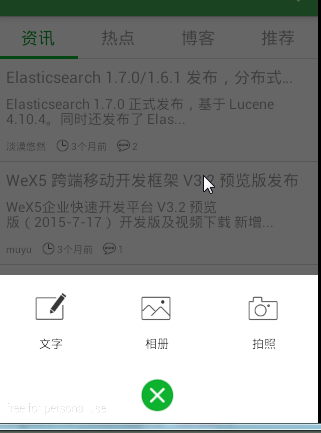

####很多的app都有这样的对话框

1.定义一个类继承自Dialog或者AlertDialog;
 
	public class QuickOptionDialog extends Dialog implements
	        android.view.View.OnClickListener {
	
	    private ImageView mClose;
	
	    public interface OnQuickOptionformClick {
	        void onQuickOptionClick(int id);
	    }
	
	    private OnQuickOptionformClick mListener;
	
	    private QuickOptionDialog(Context context, boolean flag,
	            OnCancelListener listener) {
	        super(context, flag, listener);
	    }
	
	    @SuppressLint("InflateParams")
	    private QuickOptionDialog(Context context, int defStyle) {
	        super(context, defStyle);
	        View contentView = getLayoutInflater().inflate(
	                R.layout.dialog_quick_option, null);
	        contentView.findViewById(R.id.ly_quick_option_text).setOnClickListener(
	                this);
	        contentView.findViewById(R.id.ly_quick_option_album)
	                .setOnClickListener(this);
	        contentView.findViewById(R.id.ly_quick_option_photo)
	                .setOnClickListener(this);
	        mClose = (ImageView) contentView.findViewById(R.id.iv_close);
	
	        Animation operatingAnim = AnimationUtils.loadAnimation(getContext(),
	                R.anim.quick_option_close);
	        LinearInterpolator lin = new LinearInterpolator();
	        operatingAnim.setInterpolator(lin);
	
	        mClose.startAnimation(operatingAnim);
	
	        mClose.setOnClickListener(this);
	        requestWindowFeature(Window.FEATURE_NO_TITLE);
	        contentView.setOnTouchListener(new View.OnTouchListener() {
	            @Override
	            public boolean onTouch(View v, MotionEvent event) {
	                QuickOptionDialog.this.dismiss();
	                return true;
	            }
	        });
	        super.setContentView(contentView);
	
	    }
	
	    public QuickOptionDialog(Context context) {
	        this(context, R.style.quick_option_dialog);
	    }
	
	    @SuppressWarnings("deprecation")
	    @Override
	    protected void onCreate(Bundle bundle) {
	        super.onCreate(bundle);
	        getWindow().setGravity(Gravity.BOTTOM);
	
	        WindowManager m = getWindow().getWindowManager();
	        Display d = m.getDefaultDisplay();
	        WindowManager.LayoutParams p = getWindow().getAttributes();
	        p.width = d.getWidth();
	        getWindow().setAttributes(p);
	    }
	
	    public void setOnQuickOptionformClickListener(OnQuickOptionformClick lis) {
	        mListener = lis;
	    }
	
	    @Override
	    public void onClick(View v) {
	        final int id = v.getId();
	        switch (id) {
	        case R.id.iv_close:
	            dismiss();
	            break;
	//        case R.id.ly_quick_option_text:
	//            onClickTweetPub(R.id.ly_quick_option_text);
	//            break;
	//        case R.id.ly_quick_option_album:
	//            onClickTweetPub(R.id.ly_quick_option_album);
	//            break;
	//        case R.id.ly_quick_option_photo:
	//            onClickTweetPub(R.id.ly_quick_option_photo);
	//            break;
	//        case R.id.ly_quick_option_voice:
	//            UIHelper.showSimpleBack(getContext(), SimpleBackPage.RECORD);
	//            break;
	//        case R.id.ly_quick_option_scan:
	//            UIHelper.showScanActivity(getContext());
	//            break;
	//        case R.id.ly_quick_option_note:
	            // UIHelper.showSimpleBack(getContext(), SimpleBackPage.FIND_USER);
	//            onClickNote();
	            //UIHelper.showSimpleBack(getContext(), SimpleBackPage.FIND_USER);
	            // onClickNote();
	//            break;
	        default:
	            break;
	        }
	        if (mListener != null) {
	            mListener.onQuickOptionClick(id);
	        }
	        dismiss();
	    }
	
	//    private void onClickTweetPub(int id) {
	//        Bundle bundle = new Bundle();
	//        int type = -1;
	//        switch (id) {
	//        case R.id.ly_quick_option_album:
	//            type = TweetPubFragment.ACTION_TYPE_ALBUM;
	//            break;
	//        case R.id.ly_quick_option_photo:
	//            type = TweetPubFragment.ACTION_TYPE_PHOTO;
	//            break;
	//        default:
	//            break;
	//        }
	//        bundle.putInt(TweetPubFragment.ACTION_TYPE, type);
	//        UIHelper.showTweetActivity(getContext(), SimpleBackPage.TWEET_PUB,
	//                bundle);
	//    }
	
	//    private void onClickNote() {
	//        Bundle bundle = new Bundle();
	//        bundle.putInt(NoteEditFragment.NOTE_FROMWHERE_KEY,
	//                NoteEditFragment.QUICK_DIALOG);
	//        UIHelper.showSimpleBack(getContext(), SimpleBackPage.NOTE_EDIT, bundle);
	//    }
	}

2.在2个参数的构造方法中，自定义style继承自Theme.Holo.Light.Dialog；
    可以在自定义style中指定背景和dialog的动画;

	

	

<item name="android:windowBackground">用来指定背景可以是.9.png或者@color
<item name="android:windowAnimationStyle">来添加动画 以下是:

	

以下是dialog_enter.xml 打开时动画文件

	<?xml version="1.0" encoding="utf-8"?>
	<set xmlns:android="http://schemas.android.com/apk/res/android" >
	
	    <translate
	        android:duration="200"
	        android:toYDelta="0%"
	        android:fillAfter="true"
	        android:fromYDelta="100%p" />
	</set>

以下是dialog_exit.xml 关闭时动画文件

	<?xml version="1.0" encoding="utf-8"?>
	<set xmlns:android="http://schemas.android.com/apk/res/android" >
	
	    <translate
	        android:duration="200"
	        android:fromYDelta="0%"
	        android:fillAfter="true"
	        android:toYDelta="100%p" />
	</set>

3.初始化view对象，最终setContentView(view);
 当对话框显示的时候会走onCreate()方法,在这里面可以指定对话框出现的位置:

4.可以指定对话框出现的位置:

	getWindow().setGravity(Gravity.BOTTOM);//设置对话框的布局出现在底部

没有getWindow().setGravity(Gravity.BOTTOM);这行代码dialog会默认显示到屏幕中间

getWindow().setGravity(Gravity.TOP);//设置对话框的布局出现在顶部

